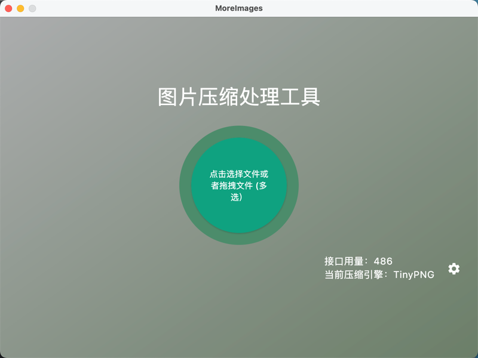
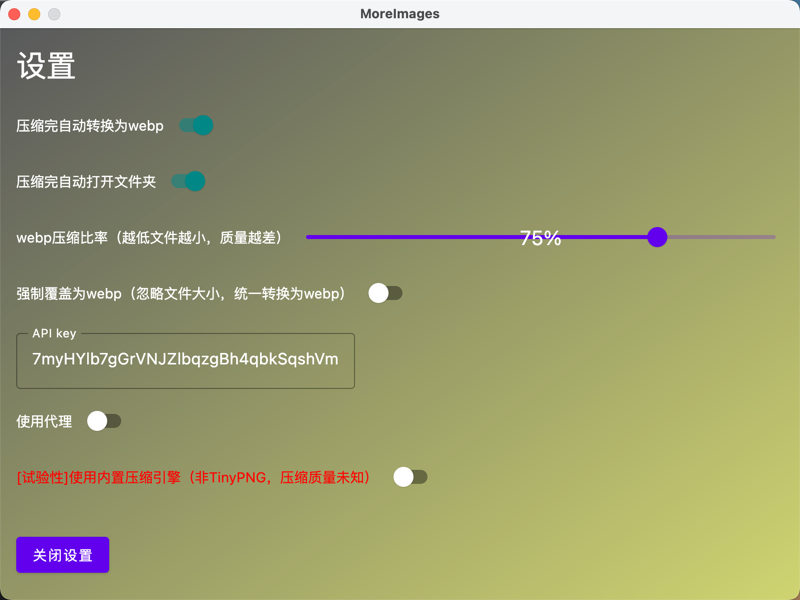

## MoreImages

跨平台图片压缩工具，同时支持本地压缩引擎和TinyPNG API，支持智能转换webp格式。

### 主界面

### 设置

### 细节实现

大多数代码由GPT-4生成

### TODO

- [ ] 自定义保存路径
- [x] 自定义TinyPNG压缩轮数
- [ ] 支持拖拽/加载文件夹
- [ ] 支持选择是否删除源文件
- [x] 支持仅webp转换模式
